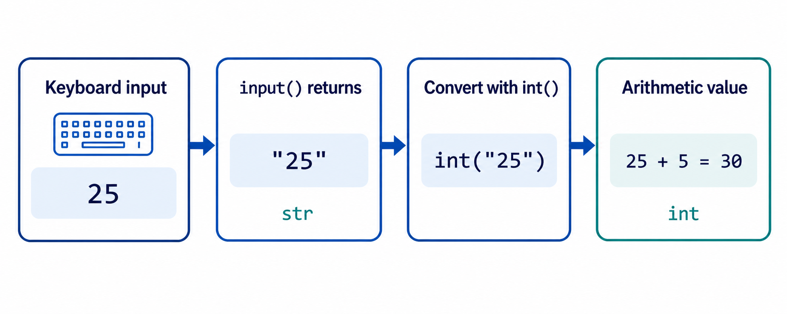

# Module 1: Python Fundamentals and Introduction to Data Structures

**Course:** Algorithms and Programming
**Programming language:** Python 3.10+
**Estimated study time:** 3 to 4 hours

## 1. Module scope

This module starts from the first executable Python statement. It introduces program source code, output, values, variables, basic operators, keyboard input, type conversion, and lists.

The final sections introduce the purpose of data structures. Students use a list as their first concrete structure. Stacks and queues appear only as an unassessed preview.

<video controls preload="metadata" width="960" aria-label="Creating and running a first Python notebook cell">
  <source src="../Assets/Module-1/first-python-program.mp4" type="video/mp4">
  Your browser does not support embedded video. Download the <a href="../Assets/Module-1/first-python-program.mp4">first Python program recording</a> instead.
</video>

## 2. Learning outcomes

After completing this module, a student should be able to:

1. run a Python statement and distinguish source code from program output;
2. use literals, variables, comments, and meaningful identifiers;
3. perform arithmetic and comparison operations with numeric values;
4. read text with `input()` and convert numeric text with `int()` or `float()`;
5. display values using `print()` and f-strings;
6. create, inspect, update, and extend a simple list;
7. calculate total and average production from a list of observations;
8. explain why programs use data structures to organize related values.

## 3. Environment and working method

You may run the examples in:

- a Jupyter notebook;
- Visual Studio Code with a Python extension;
- an interactive Python shell;
- a `.py` file executed with Python 3.10 or later.

In a notebook, place one example in one code cell and run the cell. In a `.py` file, save the file before running it.

Examples in this module show only the code that you should type. Output is shown in a separate `text` block when it is important.

### 3.1 Suggested study schedule

| Activity | Time |
| --- | ---: |
| First program, statements, and comments | 35 minutes |
| Values, variables, and operators | 60 minutes |
| Input, conversion, and output | 30 minutes |
| Introduction to lists and data structures | 45 minutes |
| Study case, practice, and knowledge check | 40 minutes |
| **Total** | **210 minutes** |

## 4. The first Python program

Enter and run this statement:

```python
print("Hello, World!")
```

Output:

```text
Hello, World!
```

`print()` is a built-in Python function. The text between quotation marks is a string. Calling `print()` sends a readable representation of its argument to standard output [1].

The important parts are:

| Part | Role |
| --- | --- |
| `print` | Function name |
| `(` and `)` | Enclose the function argument |
| `"Hello, World!"` | String value |

Python is case-sensitive:

```text
print("Valid")
Print("Invalid")
```

`print` and `Print` are different names. The second line raises `NameError` unless a name called `Print` was defined earlier.

## 5. Source code, statements, and comments

**Source code** is the text written by a programmer. A **statement** is an instruction that Python can execute.

These are two separate statements:

```python
print("Production system")
print("Status: active")
```

A comment begins with `#` and continues to the end of the physical line [1]. Python ignores comments during normal execution.

```python
# Store the planned quantity for one shift.
planned_units = 500

actual_units = 475  # Recorded at the end of the shift.
print(actual_units)
```

Comments should explain a decision, unit, assumption, or constraint. They should not repeat code that is already clear.

Weak:

```python
units = 500  # Set units to 500.
```

More useful:

```python
units = 500  # Units planned for one eight-hour shift.
```

## 6. Values and basic data types

A **value** is data processed by a program. Every Python value has a type. A type determines which operations are valid.

The four basic types used in this module are:

| Type | Purpose | Examples |
| --- | --- | --- |
| `int` | Whole numbers | `0`, `25`, `-4` |
| `float` | Numbers with a fractional part | `2.5`, `0.0`, `-1.25` |
| `str` | Text | `"pump"`, `"TSI-01"` |
| `bool` | Logical result | `True`, `False` |

```python
production_count = 480
cycle_time = 2.75
machine_name = "Cutting Station"
machine_active = True

print(type(production_count).__name__)
print(type(cycle_time).__name__)
print(type(machine_name).__name__)
print(type(machine_active).__name__)
```

Output:

```text
int
float
str
bool
```

Quotation marks matter:

```python
numeric_value = 25
text_value = "25"

print(numeric_value + 5)
print(text_value + "5")
```

Output:

```text
30
255
```

The first `+` performs numeric addition. The second joins two strings.

## 7. Variables and assignment

A **variable** is a name bound to a value. Assignment uses one equals sign:

```python
daily_target = 1000
product_name = "Steel Bracket"
```

Read assignment from right to left:

1. Python evaluates the expression on the right.
2. Python binds the resulting value to the name on the left.

Assignment can update a name:

```python
completed_units = 120
completed_units = completed_units + 30

print(completed_units)
```

Output:

```text
150
```

The shorter form is an augmented assignment:

```python
completed_units = 120
completed_units += 30

assert completed_units == 150
```

### 7.1 Identifier rules

A Python identifier:

- may contain letters, digits, and underscores;
- cannot begin with a digit;
- cannot contain spaces or hyphens;
- cannot be a Python keyword such as `if`, `for`, or `while`;
- is case-sensitive.

Use descriptive `snake_case` names:

```python
hourly_output = 75
defect_rate = 0.02
```

Avoid unclear names:

```text
x = 75
a = 0.02
```

## 8. Arithmetic operators

Python supports the following basic numeric operators [1]:

| Operator | Meaning | Example | Result |
| --- | --- | --- | ---: |
| `+` | Addition | `8 + 3` | `11` |
| `-` | Subtraction | `8 - 3` | `5` |
| `*` | Multiplication | `8 * 3` | `24` |
| `/` | Division | `8 / 3` | `2.666...` |
| `//` | Floor division | `8 // 3` | `2` |
| `%` | Remainder | `8 % 3` | `2` |
| `**` | Exponentiation | `8 ** 2` | `64` |

```python
available_minutes = 485
cycle_minutes = 12

complete_cycles = available_minutes // cycle_minutes
unused_minutes = available_minutes % cycle_minutes

print(complete_cycles)
print(unused_minutes)
```

Output:

```text
40
5
```

Parentheses make the intended order explicit:

```python
material_cost = 250_000
labor_cost = 175_000
units_produced = 50

unit_cost = (material_cost + labor_cost) / units_produced
assert unit_cost == 8500.0
```

The underscore in `250_000` improves readability. It does not change the numeric value.

## 9. Comparison and logical operators

A comparison produces `True` or `False`.

| Operator | Meaning |
| --- | --- |
| `==` | Equal |
| `!=` | Not equal |
| `<` | Less than |
| `<=` | Less than or equal |
| `>` | Greater than |
| `>=` | Greater than or equal |

```python
actual_units = 510
target_units = 500

target_reached = actual_units >= target_units
exactly_on_target = actual_units == target_units

print(target_reached)
print(exactly_on_target)
```

Output:

```text
True
False
```

Basic logical operators combine or reverse Boolean values:

```python
temperature_ok = True
guard_closed = True

safe_to_run = temperature_ok and guard_closed
needs_attention = not safe_to_run

assert safe_to_run is True
assert needs_attention is False
```

Branching with these results begins in Module 2.

## 10. Displaying program results

`print()` can display several values:

```python
product = "Valve"
quantity = 40

print("Product:", product)
print("Quantity:", quantity)
```

An f-string places an expression inside `{}` [2]:

```python
product = "Valve"
quantity = 40
unit_price = 12_500
total_price = quantity * unit_price

print(f"{quantity} units of {product}")
print(f"Total price: Rp{total_price:,}")
```

Output:

```text
40 units of Valve
Total price: Rp500,000
```

Use formatting only after the underlying calculation is correct.

## 11. Reading input and converting types

`input()` displays an optional prompt, reads one line, removes the trailing newline, and returns a string [3].

Run this example interactively:

```python
operator_name = input("Operator name: ")
print(f"Welcome, {operator_name}.")
```

Even when a user types digits, `input()` returns text:

```python
raw_quantity = input("Produced units: ")
print(type(raw_quantity).__name__)
```

To calculate with numeric input, convert it:

```python
raw_quantity = input("Produced units: ")
quantity = int(raw_quantity)
remaining = 500 - quantity

print(f"Remaining target: {remaining}")
```

Common conversions:

| Conversion | Example | Result |
| --- | --- | --- |
| `int(text)` | `int("25")` | `25` |
| `float(text)` | `float("2.5")` | `2.5` |
| `str(value)` | `str(25)` | `"25"` |

Invalid numeric text raises `ValueError`:

```text
int("twenty")
```

Testing, exception handling, and recovery are introduced in Module 7. For now, enter input that matches the requested format.



## 12. Why data structures are needed

Separate variables work for a very small number of values:

```python
hour_1 = 72
hour_2 = 68
hour_3 = 75
```

This design becomes difficult to extend when a shift has many observations. A **data structure** organizes related values so a program can store and process them as one unit.

Python provides several built-in structures:

| Structure | Written with | Introductory purpose |
| --- | --- | --- |
| List | `[value1, value2]` | Ordered values that may change |
| Tuple | `(value1, value2)` | Ordered values treated as fixed |
| Dictionary | `{"key": value}` | Values accessed by meaningful keys |
| Set | `{value1, value2}` | Unique values |

This module uses only lists. Tuples, aliasing, dictionaries, and other structures receive dedicated treatment later.

## 13. Lists as the first data structure

A list groups values inside square brackets. Python lists are mutable, which means their contents can change [1].

```python
hourly_output = [72, 68, 75, 80]
print(hourly_output)
```

List positions use zero-based indexing:

```python
hourly_output = [72, 68, 75, 80]

first_hour = hourly_output[0]
last_hour = hourly_output[-1]

assert first_hour == 72
assert last_hour == 80
```

Update one item by assigning to its index:

```python
hourly_output = [72, 68, 75, 80]
hourly_output[1] = 70

assert hourly_output == [72, 70, 75, 80]
```

Append a new item at the end:

```python
hourly_output = [72, 70, 75, 80]
hourly_output.append(78)

assert hourly_output == [72, 70, 75, 80, 78]
```

Useful introductory operations:

```python
hourly_output = [72, 70, 75, 80, 78]

observation_count = len(hourly_output)
total_output = sum(hourly_output)
average_output = total_output / observation_count

assert observation_count == 5
assert total_output == 375
assert average_output == 75.0
```

Indexing a missing position raises `IndexError`:

```text
values = [10, 20]
print(values[2])
```

Valid indices for this list are `0` and `1`.

## 14. Study case: Daily Production Calculator

### 14.1 Problem

A production supervisor records output from four periods. The program must calculate:

- total production;
- average production per period;
- difference from the daily target;
- a readable report.

### 14.2 Data model

| Name | Meaning | Type |
| --- | --- | --- |
| `period_output` | Units completed in each period | `list` of `int` |
| `daily_target` | Planned units for the day | `int` |
| `total_output` | Sum of all periods | `int` |
| `average_output` | Mean units per period | `float` |
| `target_difference` | Actual total minus target | `int` |

### 14.3 Implementation

```python
period_output = [120, 135, 128, 142]
daily_target = 500

total_output = sum(period_output)
period_count = len(period_output)
average_output = total_output / period_count
target_difference = total_output - daily_target

print("DAILY PRODUCTION REPORT")
print(f"Recorded periods: {period_count}")
print(f"Total output: {total_output} units")
print(f"Average output: {average_output:.2f} units")
print(f"Difference from target: {target_difference:+d} units")

assert total_output == 525
assert average_output == 131.25
assert target_difference == 25
```

Output:

```text
DAILY PRODUCTION REPORT
Recorded periods: 4
Total output: 525 units
Average output: 131.25 units
Difference from target: +25 units
```

The list stores related measurements. `sum()` combines them, `len()` provides the number of periods, and the calculated values are stored under descriptive names.

### 14.4 Boundary condition

Average calculation requires at least one observation. Dividing by `len([])` would divide by zero. Module 2 introduces conditions that can handle an empty list safely.

## 15. Conceptual preview: stacks and queues

This section is not assessed.

A **stack** processes the most recently added item first. This is called last in, first out. An undo history is a common example.

A **queue** processes the earliest added item first. This is called first in, first out. A service waiting line is a common example.

At this stage, focus on the ordering rule:

```text
Stack: newest item leaves first
Queue: oldest item leaves first
```

Implementation details, operation costs, and formal invariants are deferred until students have stronger control-flow and collection skills.

<video controls loop muted playsinline preload="metadata" width="100%" aria-label="Animation comparing LIFO plates in a stack with FIFO customers in a waiting line">
  <source src="../Assets/Module-1/stack-queue-preview.mp4" type="video/mp4">
  Your browser does not support embedded MP4 video.
</video>

## 16. Common beginner errors

### 16.1 Missing quotation marks

```text
print(Hello)
```

Python treats `Hello` as a variable name. Use `"Hello"` for text.

### 16.2 Using `=` for comparison

```text
actual = target
```

This assigns. Use `actual == target` to compare.

### 16.3 Combining a string and integer directly

```text
quantity = 25
print("Quantity: " + quantity)
```

Use a comma, an f-string, or explicit conversion:

```python
quantity = 25
print("Quantity:", quantity)
print(f"Quantity: {quantity}")
```

### 16.4 Forgetting that `input()` returns text

```text
quantity = input("Quantity: ")
total = quantity + 10
```

Convert first:

```text
quantity = int(input("Quantity: "))
```

### 16.5 Using an invalid list index

For a list with four items, the valid non-negative indices are `0`, `1`, `2`, and `3`.

## 17. Guided practice

Given:

```python
morning_output = 125
afternoon_output = 140
daily_target = 250
```

Complete the calculations:

```text
total_output = ______________________________
target_difference = _________________________
average_output = _____________________________
```

Expected values:

```text
total_output = 265
target_difference = 15
average_output = 132.5
```

## 18. Independent practice

### Task 1: Material requirement

A product requires `2.5` kilograms of material. A shift plans to produce `120` products. Calculate and print the total material requirement with two decimal places.

Expected numeric result:

```text
300.00
```

### Task 2: Five-period summary

Create a list containing five period outputs. Calculate its length, total, and average. Update one incorrect item before performing the final calculation.

Success criteria:

- the list contains exactly five numeric values;
- one item is corrected using index assignment;
- the total uses `sum()`;
- the average uses the list length rather than a hard-coded number.

### Task 3: Interactive production estimate

Read a product name, planned quantity, and unit processing time. Convert numeric input and print the estimated total processing time.

Assume the user enters valid numeric text.

## 19. Knowledge check

1. What is the difference between `25` and `"25"`?
2. What does one equals sign do?
3. What type does `input()` return?
4. What is the result of `17 // 5`?
5. What is the result of `17 % 5`?
6. What is the first valid list index?
7. Which operation adds an item to the end of a list?
8. Why is a list more suitable than eight separate variables for eight hourly observations?
9. Is stack implementation assessed in this module?

<details>
<summary>Answer guide</summary>

1. `25` is an integer; `"25"` is a string.
2. It assigns the value on the right to the name on the left.
3. `str`.
4. `3`.
5. `2`.
6. `0`.
7. `append()`.
8. A list stores the observations as one ordered collection and supports shared operations such as `len()` and `sum()`.
9. No. Stacks and queues are only a conceptual preview here.

</details>

## 20. Module synthesis

The progression in this module is:

```text
statement
    -> value and type
    -> variable and expression
    -> input and output
    -> several related values
    -> list data structure
```

A program begins with small executable statements. Data structures become necessary when several values must be stored and processed under one consistent organization.

## References

1. Python Software Foundation. "An Informal Introduction to Python." *Python 3.14.7 Documentation*. Accessed 2 September 2026. https://docs.python.org/3/tutorial/introduction.html
2. Python Software Foundation. "Input and Output." *Python 3.14.7 Documentation*. Accessed 2 September 2026. https://docs.python.org/3/tutorial/inputoutput.html
3. Python Software Foundation. "Built-in Functions: `input()`." *Python 3.14.7 Documentation*. Accessed 2 September 2026. https://docs.python.org/3/library/functions.html#input

---

**Next module:** Module 2: Basic Branching and Iteration
